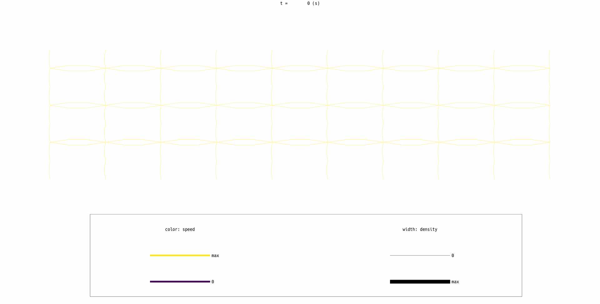
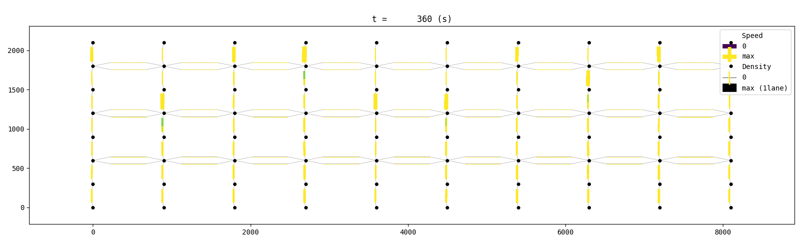
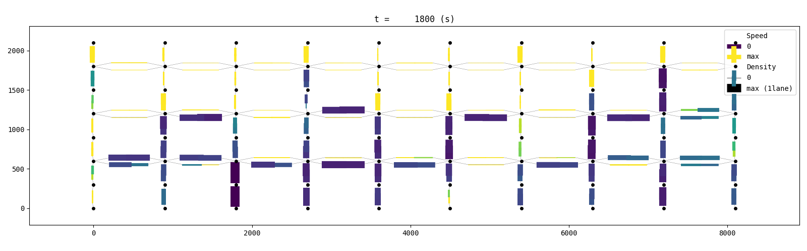
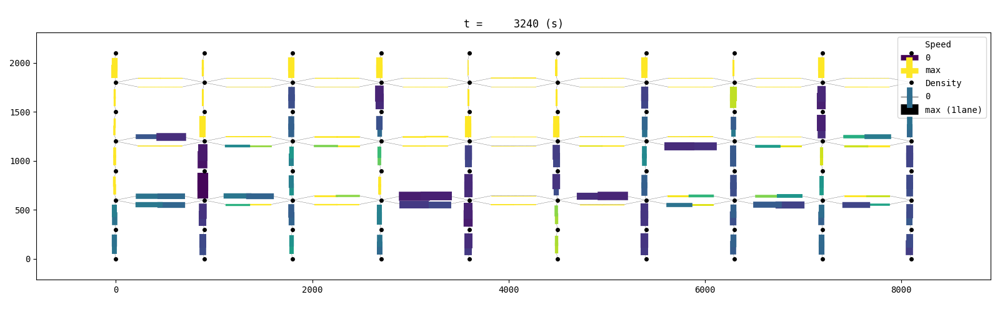
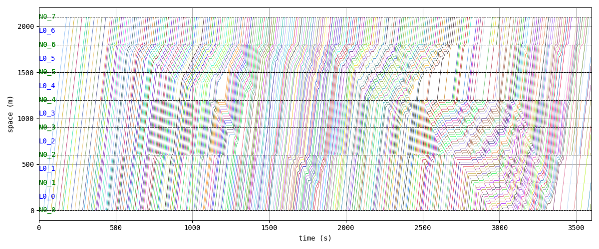
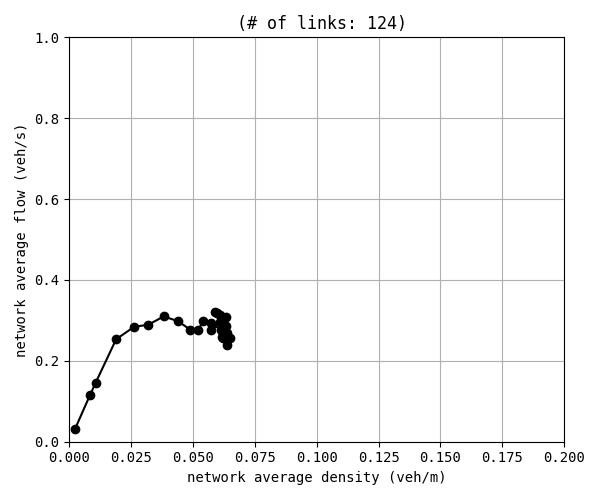
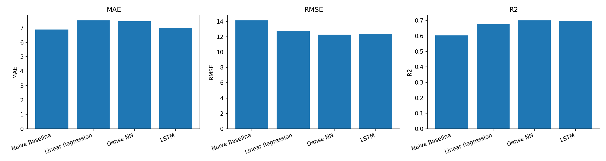
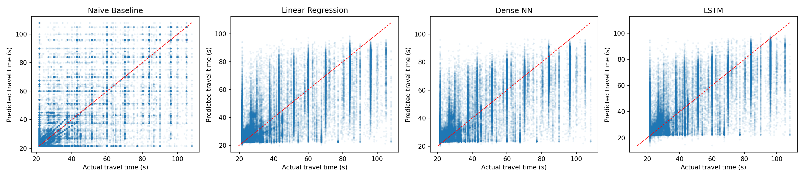
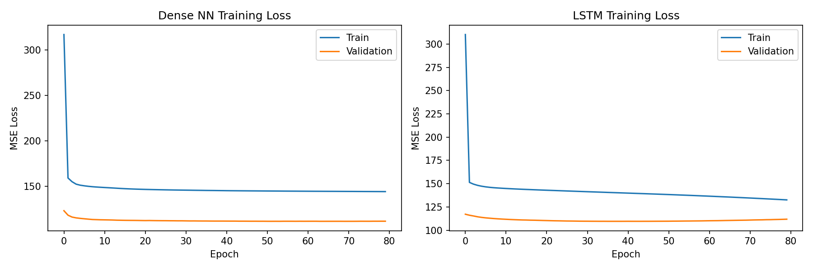

# Short-Term Travel Time Prediction: A Numerical Experiment

## 1. Introduction

This report presents a numerical experiment on **short-term link-level travel time prediction** in a simulated traffic network.
We generate synthetic traffic data with substantial congestion using the mesoscopic traffic simulator [UXsim](https://github.com/toruseo/UXsim), then compare four prediction methods:

0. **Naive Baseline** — predicts that the next travel time equals the current travel time
1. **Linear Regression**
2. **Dense Neural Network** (Multi-Layer Perceptron)
3. **Long Short-Term Memory (LSTM)** Recurrent Neural Network

The prediction task is: **given the travel times of a link and the mean travel time of its network-adjacent neighbours at the past 5 time-steps (each 30 seconds apart), predict the travel time at the next time-step.**

## 2. Mathematical Formulation of Methods

Let $\text{TT}_t$ denote the travel time of the target link at time-step $t$, and let $\overline{\text{TT}}^{\text{nbr}}_t$ denote the mean travel time of its network-adjacent neighbours (links sharing at least one node) at time-step $t$.  The input is:

$$\mathbf{x}_t = (\text{TT}_{t-L}, \dots, \text{TT}_{t-1},\; \overline{\text{TT}}^{\text{nbr}}_{t-L}, \dots, \overline{\text{TT}}^{\text{nbr}}_{t-1})$$

where $L = 5$ is the lookback window.  The target is $\hat{y}_t \approx \text{TT}_t$.

### 2.0 Naive Baseline

The simplest possible predictor assumes travel time does not change:

$$\hat{y}_t = \text{TT}_{t-1}$$

This is a strong baseline because traffic conditions are often persistent over short intervals.

### 2.1 Linear Regression

Linear regression models the next travel time as a weighted sum of past travel times:

$$\hat{y}_t = \sum_{k=1}^{L} w_k \, \text{TT}_{t-k} + b$$

The parameters $\{w_k, b\}$ are found by minimising the ordinary least-squares objective:

$$\min_{\mathbf{w}, b} \sum_{i=1}^{N} \left( y_i - \mathbf{w}^\top \mathbf{x}_i - b \right)^2$$

### 2.2 Dense Neural Network (MLP)

A multi-layer perceptron applies successive non-linear transformations:

$$\mathbf{h}_1 = \text{ReLU}(\mathbf{W}_1 \mathbf{x} + \mathbf{b}_1) \quad \in \mathbb{R}^{64}$$

$$\mathbf{h}_2 = \text{ReLU}(\mathbf{W}_2 \mathbf{h}_1 + \mathbf{b}_2) \quad \in \mathbb{R}^{32}$$

$$\hat{y} = \mathbf{w}_3^\top \mathbf{h}_2 + b_3$$

where $\text{ReLU}(z) = \max(0, z)$.
The network is trained by minimising the mean squared error (MSE) loss via the Adam optimiser.

### 2.3 LSTM

The LSTM processes the sequence of $L$ past travel times $(\text{TT}_{t-L}, \dots, \text{TT}_{t-1})$.
At each step $k$, the LSTM cell updates its hidden state $\mathbf{h}_k$ and cell state $\mathbf{c}_k$:

$$\mathbf{f}_k = \sigma(\mathbf{W}_f [\mathbf{h}_{k-1}, x_k] + \mathbf{b}_f)$$

$$\mathbf{i}_k = \sigma(\mathbf{W}_i [\mathbf{h}_{k-1}, x_k] + \mathbf{b}_i)$$

$$\tilde{\mathbf{c}}_k = \tanh(\mathbf{W}_c [\mathbf{h}_{k-1}, x_k] + \mathbf{b}_c)$$

$$\mathbf{c}_k = \mathbf{f}_k \odot \mathbf{c}_{k-1} + \mathbf{i}_k \odot \tilde{\mathbf{c}}_k$$

$$\mathbf{o}_k = \sigma(\mathbf{W}_o [\mathbf{h}_{k-1}, x_k] + \mathbf{b}_o)$$

$$\mathbf{h}_k = \mathbf{o}_k \odot \tanh(\mathbf{c}_k)$$

where $\sigma$ is the sigmoid function and $\odot$ denotes element-wise multiplication.
The final hidden state $\mathbf{h}_L$ is passed through a dense layer to produce $\hat{y}$.

## 3. Experiment Design

### 3.1 Network Topology

We adopt an **interconnected corridor network**: 10 parallel one-directional corridors, each containing a capacity bottleneck, linked by **bidirectional lateral cross-connections** at three intermediate positions.  This design creates realistic inter-corridor interactions — when one corridor is congested, vehicles can reroute to adjacent corridors, and congestion spills over between neighbours.

| Parameter | Value |
|---|---|
| Corridors | 10 parallel one-directional corridors |
| Nodes per corridor | 8 (7 links each) |
| Corridor links | 70 |
| Cross-link positions | Nodes 2, 4, 6 (bidirectional between adjacent corridors) |
| Cross-links | 54 (9 pairs × 3 positions × 2 directions) |
| Total links | 124 |
| Link length | 300 m (corridor and cross-links) |
| Free-flow speed | 50 km/h (13.9 m/s) |
| Normal jam density | 0.2 veh/m |
| Bottleneck jam density | 0.05 veh/m (25% of normal capacity) |
| Free-flow travel time | 21.6 s per link |

Each corridor has **one bottleneck link** placed near the downstream end (positions 4–6, randomised per corridor).  The lateral cross-links at positions 2, 4, and 6 allow vehicles to detour through adjacent corridors to avoid bottlenecks.  This creates **route choice** and **congestion spillover**: when a corridor's bottleneck becomes heavily congested, diverted traffic increases load on neighbouring corridors, producing complex inter-corridor congestion dynamics.

### 3.2 Demand Generation

- **30 simulation scenarios** are run, each with a different `demand_scale` sampled uniformly from [1.5, 3.0].
- Each corridor receives one-directional demand from its origin to its destination node.
- **Cross-corridor demand** is added between adjacent corridors (origin of corridor $c$ to destination of corridor $c\pm1$) at approximately 30% of the cross-corridor base rate, ensuring that vehicles actively use the lateral connections.
- A **trapezoidal demand profile** (ramp-up 0–10%, plateau 10–85%, wind-down 85–100%) maintains high demand for most of the simulation, ensuring sustained congestion rather than a brief peak.
- Base flow rates are randomised per corridor within [0.15, 0.35] veh/s (scaled by `demand_scale`).
- The simulation uses a platoon size (`deltan`) of 5 vehicles and runs for **3600 seconds (1 hour)**.

### 3.3 Traffic Simulation Visualisation

The following visualisations (produced by UXsim's built-in analysis tools on a representative scenario with `demand_scale = 2.5`) illustrate the congestion dynamics that the prediction models must capture.

#### Network State Animation



The animated GIF shows the evolution of traffic density and speed across all 10 interconnected corridors over the full 1-hour simulation.  Link colour indicates speed (yellow = free-flow, dark blue/purple = congested) and link width indicates density.  The vertical cross-links between corridors are visible, carrying traffic between adjacent corridors.  Congestion builds upstream of each corridor's bottleneck and spills over to neighbouring corridors via the cross-links.

#### Network Snapshots

| t = 360 s (early ramp-up) | t = 1800 s (peak congestion) | t = 3240 s (wind-down) |
|:---:|:---:|:---:|
|  |  |  |

Three snapshots at key moments: (left) early in the simulation when demand is still ramping up and most links are in free-flow; (centre) mid-simulation when sustained high demand has created long queues upstream of bottlenecks, with spillover visible on cross-links; (right) late in the simulation as demand winds down and queues begin to dissipate.

#### Time-Space Trajectory Diagram (Corridor 0)



Each line traces one vehicle's trajectory through the 7 consecutive links of corridor 0.  The horizontal axis is time, and the vertical axis is cumulative distance along the corridor.  Trajectories that are steep (nearly vertical) indicate high speed (free-flow), while trajectories that flatten out indicate vehicles slowing down or stopping in a queue.  The queue growth and dissipation wave is clearly visible.

#### Macroscopic Fundamental Diagram (MFD)



The MFD shows the relationship between network-wide vehicle accumulation and flow.  The characteristic inverted-U shape confirms that the simulation produces both free-flow conditions (rising limb) and congested conditions (falling limb), validating the network design.

### 3.4 Prediction Task

This is a **short-term prediction** problem with **spatial features**:

- **Input**: Travel times of the target link *and* the mean travel time of its network-adjacent neighbours at the past $L = 5$ time-steps (covering 2.5 minutes at 30 s intervals).  Two links are considered neighbours if they share a node in the network graph.  This gives $2L = 10$ input features per sample.
- **Output**: Travel time at the next time-step (30 s ahead)
- Sequences are built per (scenario, link) group, sorted by time

### 3.5 Train/Test Split

- Data is split by **scenario**: 21 scenarios for training (~70%) and 9 scenarios for testing (~30%).
- This ensures the models generalise to unseen traffic conditions rather than memorising specific scenarios.

### 3.6 Model Configuration

| Hyperparameter | Linear Reg. | Dense NN | LSTM |
|---|---|---|---|
| Input features | 5 past TTs + 5 mean-nbr TTs | 5 past TTs + 5 mean-nbr TTs | 5 past TTs + 5 mean-nbr TTs |
| Hidden layers | — | 2 (64, 32 units) | 1 LSTM (64 units) + 1 Dense (32) |
| Activation | — | ReLU | tanh/sigmoid (LSTM) + ReLU |
| Optimiser | — | Adam | Adam |
| Loss function | OLS | MSE | MSE |
| Epochs | — | 80 | 80 |
| Batch size | — | 256 | 256 |

All features are standardised (zero mean, unit variance) before training.

## 4. Results

### 4.1 Dataset Statistics

| Statistic | Value |
|---|---|
| Total records | 372,974 |
| Training records | 263,286 |
| Test records | 109,688 |
| Train sequences | 250,266 |
| Test sequences | 104,108 |
| Unique links | 124 (70 corridor + 54 cross-links) |
| At free-flow (TT ≤ 1.01× free-flow) | 59.2% |
| Congested records (TT > 1.1× free-flow) | 38.3% |
| Heavily congested (TT > 1.5× free-flow) | 26.6% |
| Travel time range | 21.6 – 108.0 s |
| Mean travel time | 33.4 s |
| Travel time std. dev. | 21.2 s |

The interconnected network has more links (124 vs 70 previously) and produces a more varied dataset.  The cross-links enable route choice and congestion spillover between corridors, creating complex inter-corridor dynamics that make the prediction problem substantially harder.

### 4.2 Performance Metrics

| Method | MAE (s) | RMSE (s) | R² |
|---|---|---|---|
| Naive Baseline | **6.889** | 14.124 | 0.603 |
| Linear Regression | 7.521 | 12.757 | 0.676 |
| Dense NN | 7.468 | **12.282** | **0.700** |
| LSTM | 7.012 | 12.339 | 0.697 |

- **MAE** (Mean Absolute Error): average absolute prediction error.
- **RMSE** (Root Mean Squared Error): penalises large errors more heavily.
- **R²** (Coefficient of Determination): proportion of variance explained (1.0 = perfect).

**Key findings:**

1. **The prediction task is substantially harder** with the interconnected network (R² ≈ 0.60–0.70) compared to the earlier independent-corridor design (R² ≈ 0.96).  Cross-corridor interactions create complex, less predictable congestion dynamics — congestion on one corridor can spill over to neighbours via the lateral connections.  To address this, each prediction uses both the target link's own past travel times **and the mean travel time of its network-adjacent neighbours** as input features, capturing spatial dependencies from across the network.

2. **Dense NN achieves the best RMSE and R²** (12.28 s and 0.700 respectively), followed closely by the LSTM (12.34 s, 0.697).  Both outperform Linear Regression (12.76 s, 0.676) and the Naive Baseline (14.12 s, 0.603).

3. **The naive baseline has the lowest MAE** (6.89 s) because it is exactly correct whenever travel time does not change between consecutive time-steps.  However, its high RMSE reveals that it makes **large errors during congestion transitions**, which are now more frequent and less predictable due to cross-corridor spillover effects.

4. **RMSE is the more informative metric** for this problem.  The Dense NN's 13% RMSE reduction vs the naive baseline shows that learned models capture spatio-temporal patterns that persistence forecasts cannot, even in this challenging setting.

5. **Incorporating spatial features from neighbouring links improves prediction accuracy**.  By including the mean travel time of network-adjacent neighbours (links sharing at least one node), the models can capture cross-corridor congestion spillover.  The Dense NN's R² of 0.700 demonstrates that spatial features help the model account for inter-corridor interactions that single-link features alone cannot capture.

### 4.3 Visualisations

#### Performance Comparison



#### Predicted vs. Actual Travel Time



The diagonal red dashed line represents perfect prediction.  The naive baseline shows a characteristic pattern of echoing the previous value, which works well during stable periods but creates scatter during transitions.  The LSTM and Dense NN produce tighter clustering around the diagonal.

#### Training Loss Curves



Both models converge within the first 20 epochs, with the gap between training and validation loss indicating reasonable generalisation.

## 5. Conclusion

This experiment demonstrates short-term travel time prediction using past travel time observations on an interconnected corridor network with congestion spillover:

1. **The interconnected corridor network** with lateral cross-links creates realistic inter-corridor interactions.  When one corridor's bottleneck becomes congested, vehicles can reroute through adjacent corridors, causing congestion spillover that makes the prediction problem substantially harder (R² ≈ 0.60–0.70 vs ≈ 0.96 for independent corridors).

2. **Spatial features from neighbouring links improve predictions.**  By including the mean travel time of network-adjacent neighbours (links sharing at least one node) alongside the target link's own history, the models capture cross-corridor congestion spillover.  The Dense NN achieves R² = 0.700, demonstrating the value of incorporating data from across the network rather than relying on single-link time-series alone.

3. **Dense NN and LSTM outperform the naive baseline** on RMSE (13% and 13% reduction respectively) and R², demonstrating that learned models capture spatio-temporal dynamics of congestion transitions in this complex setting.

4. **The naive baseline is competitive on MAE** because it is perfect during stable conditions, but its high RMSE reveals critical failures during congestion onset and dissipation — periods that are now more frequent and less predictable due to cross-corridor spillover.

## Reproducibility

All code and data are included in this repository:

```
├── generate_data.py              # UXsim simulation and data generation
├── generate_visualizations.py    # UXsim traffic simulation visualizations
├── train_and_evaluate.py         # Model training, evaluation, and plotting
├── requirements.txt              # Python dependencies
├── data/
│   └── traffic_data.csv          # Generated synthetic traffic data
├── results/
│   ├── metrics.csv               # Numerical results
│   ├── metrics_comparison.png
│   ├── scatter_pred_vs_actual.png
│   ├── training_loss.png
│   ├── network_animation.gif     # Traffic simulation animation
│   ├── network_snapshot_*.png    # Network state snapshots
│   ├── time_space_trajectory.png # Vehicle trajectory diagram
│   └── mfd.png                   # Macroscopic fundamental diagram
└── report.md                     # This report
```

To reproduce:

```bash
pip install -r requirements.txt
python generate_data.py
python generate_visualizations.py
python train_and_evaluate.py
```
