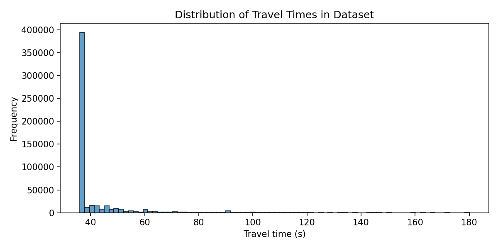
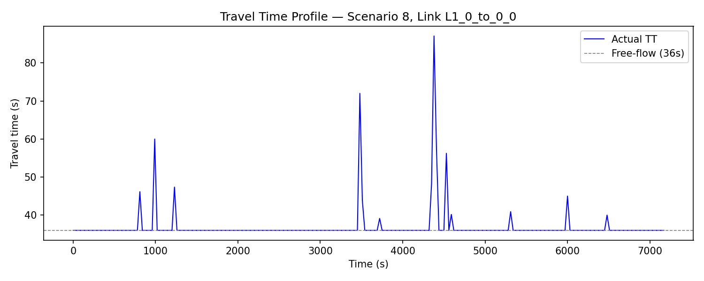

# Short-Term Travel Time Prediction: A Numerical Experiment

## 1. Introduction

This report presents a numerical experiment on **short-term link-level travel time prediction** in a simulated urban traffic network.
We generate synthetic traffic data with realistic congestion patterns using the mesoscopic traffic simulator [UXsim](https://github.com/toruseo/UXsim), then compare four prediction methods:

0. **Naive Baseline** — predicts that the next travel time equals the current travel time
1. **Linear Regression**
2. **Dense Neural Network** (Multi-Layer Perceptron)
3. **Long Short-Term Memory (LSTM)** Recurrent Neural Network

The prediction task is: **given the travel times of a link at the past 5 time-steps (each 30 seconds apart), predict the travel time at the next time-step.**

## 2. Mathematical Formulation of Methods

Let $\text{TT}_t$ denote the travel time at time-step $t$.  The input is the vector of past observations:

$$\mathbf{x}_t = (\text{TT}_{t-L}, \text{TT}_{t-L+1}, \dots, \text{TT}_{t-1})$$

where $L = 5$ is the lookback window.  The target is $\hat{y}_t \approx \text{TT}_t$.

### 2.0 Naive Baseline

The simplest possible predictor assumes travel time does not change:

$$\hat{y}_t = \text{TT}_{t-1}$$

This is a strong baseline because traffic conditions are often persistent over short intervals.

### 2.1 Linear Regression

Linear regression models the next travel time as a weighted sum of past travel times:

$$\hat{y}_t = \sum_{k=1}^{L} w_k \, \text{TT}_{t-k} + b$$

The parameters $\{w_k, b\}$ are found by minimising the ordinary least-squares objective:

$$\min_{\mathbf{w}, b} \sum_{i=1}^{N} \left( y_i - \mathbf{w}^\top \mathbf{x}_i - b \right)^2$$

### 2.2 Dense Neural Network (MLP)

A multi-layer perceptron applies successive non-linear transformations:

$$\mathbf{h}_1 = \text{ReLU}(\mathbf{W}_1 \mathbf{x} + \mathbf{b}_1) \quad \in \mathbb{R}^{64}$$

$$\mathbf{h}_2 = \text{ReLU}(\mathbf{W}_2 \mathbf{h}_1 + \mathbf{b}_2) \quad \in \mathbb{R}^{32}$$

$$\hat{y} = \mathbf{w}_3^\top \mathbf{h}_2 + b_3$$

where $\text{ReLU}(z) = \max(0, z)$.
The network is trained by minimising the mean squared error (MSE) loss via the Adam optimiser.

### 2.3 LSTM

The LSTM processes the sequence of $L$ past travel times $(\text{TT}_{t-L}, \dots, \text{TT}_{t-1})$.
At each step $k$, the LSTM cell updates its hidden state $\mathbf{h}_k$ and cell state $\mathbf{c}_k$:

$$\mathbf{f}_k = \sigma(\mathbf{W}_f [\mathbf{h}_{k-1}, x_k] + \mathbf{b}_f)$$

$$\mathbf{i}_k = \sigma(\mathbf{W}_i [\mathbf{h}_{k-1}, x_k] + \mathbf{b}_i)$$

$$\tilde{\mathbf{c}}_k = \tanh(\mathbf{W}_c [\mathbf{h}_{k-1}, x_k] + \mathbf{b}_c)$$

$$\mathbf{c}_k = \mathbf{f}_k \odot \mathbf{c}_{k-1} + \mathbf{i}_k \odot \tilde{\mathbf{c}}_k$$

$$\mathbf{o}_k = \sigma(\mathbf{W}_o [\mathbf{h}_{k-1}, x_k] + \mathbf{b}_o)$$

$$\mathbf{h}_k = \mathbf{o}_k \odot \tanh(\mathbf{c}_k)$$

where $\sigma$ is the sigmoid function and $\odot$ denotes element-wise multiplication.
The final hidden state $\mathbf{h}_L$ is passed through a dense layer to produce $\hat{y}$.

## 3. Experiment Design

### 3.1 Network Topology

A **5 × 5 grid network** is constructed with:

| Parameter | Value |
|---|---|
| Grid size | 5 × 5 (25 nodes) |
| Number of links | 80 (bi-directional) |
| Link length | 500 m |
| Free-flow speed | 50 km/h (13.9 m/s) |
| Jam density | 0.2 veh/m |
| Free-flow travel time | 36.0 s per link |

### 3.2 Demand Generation

- **30 simulation scenarios** are run, each with a different `demand_scale` sampled uniformly from [0.7, 1.0].
- Origin-destination (OD) pairs are selected between boundary nodes with a Manhattan distance ≥ 3.
- For each OD pair, demand is generated in 300-second intervals with a base flow rate randomised within [0.015, 0.04] veh/s (scaled by `demand_scale`).
- A **Gaussian peak demand pattern** is applied, centred at 40% of the simulation duration (peak factor = 2.0). This creates a realistic congestion build-up and dissipation cycle within each scenario.
- The simulation uses a platoon size (`deltan`) of 5 vehicles and runs for **7200 seconds (2 hours)**.

### 3.3 Prediction Task

This is a **short-term prediction** problem:

- **Input**: Travel times at the past $L = 5$ time-steps (covering 2.5 minutes at 30 s intervals)
- **Output**: Travel time at the next time-step (30 s ahead)
- Sequences are built per (scenario, link) group, sorted by time

### 3.4 Train/Test Split

- Data is split by **scenario**: 21 scenarios for training (~70%) and 9 scenarios for testing (~30%).
- This ensures the models generalise to unseen traffic conditions rather than memorising specific scenarios.

### 3.5 Model Configuration

| Hyperparameter | Linear Reg. | Dense NN | LSTM |
|---|---|---|---|
| Input features | 5 past TTs | 5 past TTs | 5 past TTs |
| Hidden layers | — | 2 (64, 32 units) | 1 LSTM (64 units) + 1 Dense (32) |
| Activation | — | ReLU | tanh/sigmoid (LSTM) + ReLU |
| Optimiser | — | Adam | Adam |
| Loss function | OLS | MSE | MSE |
| Epochs | — | 80 | 80 |
| Batch size | — | 256 | 256 |

All features are standardised (zero mean, unit variance) before training.

## 4. Results

### 4.1 Dataset Statistics

| Statistic | Value |
|---|---|
| Total records | 535,405 |
| Training records | 374,795 |
| Test records | 160,610 |
| Train sequences | 366,395 |
| Test sequences | 157,010 |
| Congested records (TT > 1.1× free-flow) | 24.0% |
| Heavily congested (TT > 1.5× free-flow) | 8.5% |
| Travel time range | 36.0 – 180.0 s |
| Mean travel time | 41.4 s |
| Travel time std. dev. | 15.1 s |

### 4.2 Performance Metrics

| Method | MAE (s) | RMSE (s) | R² |
|---|---|---|---|
| Naive Baseline | 6.829 | 15.425 | −0.002 |
| Linear Regression | 6.856 | 12.940 | 0.295 |
| Dense NN | 6.942 | 12.443 | **0.348** |
| LSTM | **6.833** | **12.485** | 0.343 |

- **MAE** (Mean Absolute Error): average absolute prediction error.
- **RMSE** (Root Mean Squared Error): penalises large errors more heavily.
- **R²** (Coefficient of Determination): proportion of variance explained (1.0 = perfect).

**Key findings:**

1. **All learned methods substantially outperform the naive baseline** on RMSE (≈19% reduction) and R² (from ≈0 to ≈0.35), demonstrating that past travel time patterns contain useful predictive information beyond just the current value.

2. **The Dense NN and LSTM achieve the best R²** (≈0.35), capturing non-linear dynamics in congestion transitions. The LSTM achieves the best MAE, while the Dense NN achieves the best R².

3. **Linear Regression is also effective**, achieving R² = 0.295 with a simple weighted combination of past travel times.

4. **The naive baseline has R² ≈ 0**, meaning that simply repeating the current travel time explains no more variance than predicting the overall mean. This is because, while the naive approach is perfect during stable free-flow, it fails badly during congestion transitions (onset and offset), which dominate the prediction error.

5. **MAE values are similar** across all methods (≈6.8 s) because the majority of observations are at free-flow where all methods predict similarly. The RMSE and R² differences reveal the important distinction: learned models handle congested conditions significantly better.

### 4.3 Visualisations

#### Performance Comparison


#### Predicted vs. Actual Travel Time


The diagonal red dashed line represents perfect prediction. Points above the line indicate over-prediction; points below indicate under-prediction. The naive baseline shows a characteristic pattern of repeating the current value, while the learned models provide better-calibrated predictions.

#### Training Loss Curves


Both models converge within the first 20 epochs, with the gap between training and validation loss indicating reasonable generalisation.

#### Travel Time Distribution



The distribution shows a dominant peak at the free-flow travel time (36 s) with a meaningful tail representing congested conditions up to 180 s.

#### Example Time-Series



An example of travel time evolution on a single link during one test scenario, showing the congestion build-up and dissipation pattern created by the Gaussian peak demand.

## 5. Conclusion

This experiment demonstrates short-term travel time prediction using past travel time observations:

1. **All learned methods outperform the naive baseline** (TT_next = TT_current), particularly on RMSE and R², proving that the prediction problem is non-trivial and that temporal patterns can be exploited.

2. **Dense NN and LSTM** achieve the best overall performance (R² ≈ 0.35), with LSTM providing the lowest MAE and Dense NN the highest R².

3. **Linear Regression** provides a solid middle ground with R² = 0.295, showing that even a simple linear combination of past travel times outperforms the naive approach.

4. The **Gaussian peak demand pattern** creates realistic congestion dynamics with 24% of records showing meaningful congestion, making the prediction problem substantially more challenging and meaningful than a flat-demand scenario.

## Reproducibility

All code and data are included in this repository:

```
├── generate_data.py          # UXsim simulation and data generation
├── train_and_evaluate.py     # Model training, evaluation, and plotting
├── requirements.txt          # Python dependencies
├── data/
│   └── traffic_data.csv      # Generated synthetic traffic data
├── results/
│   ├── metrics.csv           # Numerical results
│   ├── metrics_comparison.png
│   ├── scatter_pred_vs_actual.png
│   ├── training_loss.png
│   ├── travel_time_distribution.png
│   └── example_time_series.png
└── report.md                 # This report
```

To reproduce:

```bash
pip install -r requirements.txt
python generate_data.py
python train_and_evaluate.py
```
